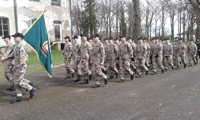

# CV
```

Vards: Rinalds
Uzvards: Akulovs
Grupa: DP1-4

```
---
# Apraks par mani.
```

Mani sauc Rinalds Akulovs. Man ir 16 gadi. Esmu dzimis Rīgā bet nupat dzīvoju Jelgavā.
Pirms mācijos (RVT) es mācijos (Jelgavas 4. vidusskolā) jeb (J4V) un pirms macijos (J4V) es macijos Ozolnieku vidusskolā.

```
# Mani hobiji.

```
Viens no maniem hobijiem ir Boks ar kuru jau nodarbojos jau 3 gadus.
```


```

Otrs mans hobijs ar kuru nodarbojos jau 4 gadus ir Jaunsardze.

```


---
## Line of code

```
print('Skaitlis 3 tiek izmantots ka pirmais skaitlis.')
print()

SkaitlisPakāpē = 3 
for x in range(6): 
   SkaitļaPakape = 3 
   SkaitlisPakāpē = SkaitlisPakāpē * SkaitļaPakape 
print('Skaitlis' + str(x+1) + ' =', SkaitlisPakāpē)
```
---
# Manas zinašanas programmešana. 

|Python 3 |C#   |HTML |
|---------|-----|-----|
|Viduvejas|Labas|Mazas|

---
# Daramie darbi.

- [x] Izdarit Sistemu programmesanu.
- [ ] Izdarit krievuvalodu.
- [ ] Nodot abus darbus.
